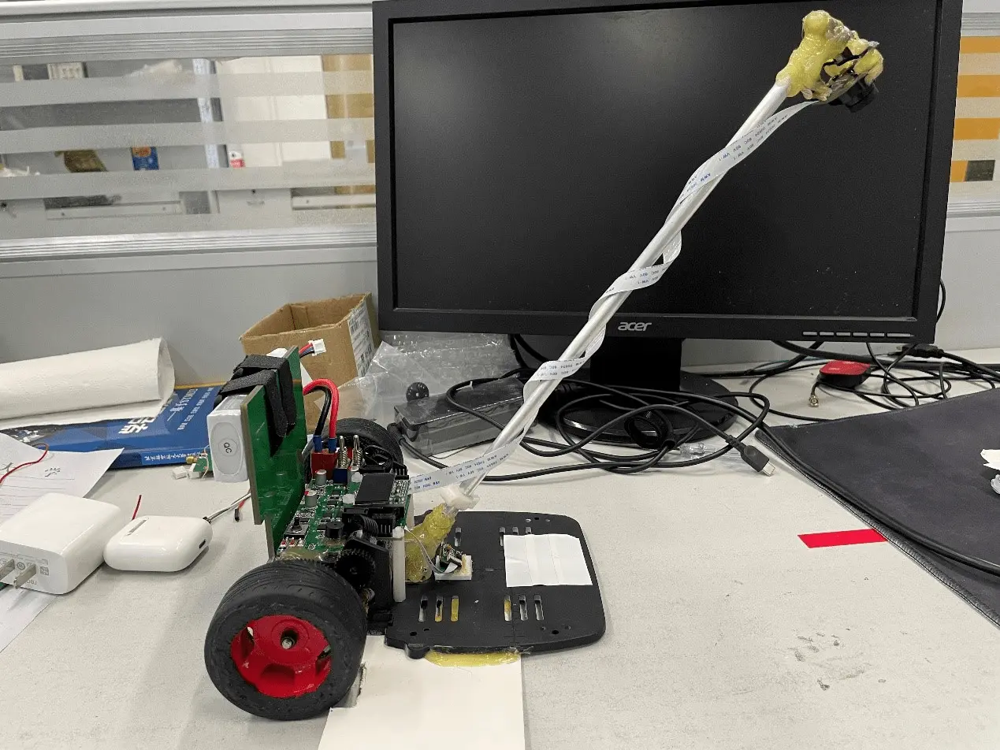
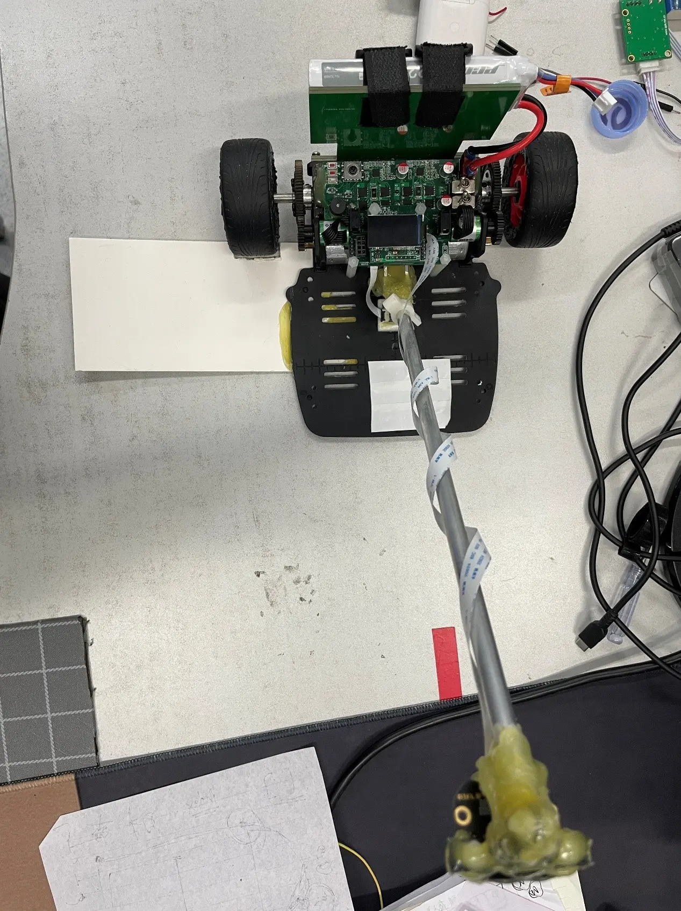

+++
title = '全国大学生智能汽车竞赛赛后经验总结'
date = 2022-11-12
tags = ["智能车"]
summary = "参加第十七届全国大学生智能汽车竞赛后的经验总结"
[sitemap]
priority = 0.9

+++

# 循迹篇

由于我们在做比赛时仅仅是个大二学生，我们不会用任何高级的控制算法，直立控制部分我们使用串级PID，速度控制部分我们使用一阶RC滤波加PID，转向也是PID。

## 姿态拟合

AHRS陀螺仪姿态解算算法主流的有三类：Mahony互补滤波，扩展卡尔曼EKF姿态融合，梯度下降。其中，互补滤波的抖动实在恐怖，EKF的运算量过大，梯度下降算法是最好用的，更重要的是：已经有大佬开源了此算法：[xioTechnologies/Fusion](https://github.com/xioTechnologies/Fusion)

## 串级PID调参经验

- 内环过小时：跑起来车会明显很软，还有可能车会贴在地上跑

- 内环过大时：会有类似手机震动一样的高频振动

- 电机的温度对车的影响很大，在电机温度较高时可以增大内环抵消

## 速度环

由于速度环为正反馈，目标速度的大幅改变必然导致震荡，所以需要加一个RC滤波器减缓震荡。

``` c
#define Speed_EncoderCof 0.1f //一阶RC滤波器滤波系数
#define SPEED_LIMIT 30.0f // 加速角度阈值
#define SPEED_DECREASE_LIMIT 16.0f // 减速角度阈值
Speed_FilterEncoder = Speed_EncoderCof * Encoder_AvgValue + (1 - Speed_EncoderCof) * Speed_FilterEncoder;
float SpeedError = Speed_FilterEncoder - TargetSpeed;
SpeedOut = arm_pid_f32(&Speed, SpeedError);

// 防止输出角度太大导致车碰地
if (SpeedOut >= SPEED_DECREASE_LIMIT)
	SpeedOut = SPEED_DECREASE_LIMIT;
else if (SpeedOut <= -SPEED_LIMIT)
	SpeedOut = -SPEED_LIMIT;
```

## 转向环

``` c
float TurnSpeedPIDLoc() {
	float Turn_Out;

	if (!BlobFoundFlag) {
		Turn_Out = arm_pid_f32(&TurnSpeed, (float) IMU_Data.gyro_z - BlobNotFoundTurn);
		if (Turn_Out < 0)
			Turn_Out = 0;
	} else {
		float AngleError = DegreeK * (-TargetAngle);
		if (AngleError > TurnLimit) {
			AngleError = TurnLimit;
			BlobFoundFlag++;

			Turn_Out = arm_pid_f32(&TurnSpeed, (float) IMU_Data.gyro_z - AngleError);
			if(Turn_Out > 0)
				Turn_Out = 0;
		} else if (AngleError < -TurnLimit) {
			AngleError = -TurnLimit;
			BlobFoundFlag++;

			Turn_Out = arm_pid_f32(&TurnSpeed, (float) IMU_Data.gyro_z - AngleError);
			if(Turn_Out < 0)
				Turn_Out = 0;
		} else {
			BlobFoundFlag = 1;

			Turn_Out = arm_pid_f32(&TurnSpeed, (float) IMU_Data.gyro_z - AngleError);
		}
	}

	/// 关闭转向环
//	TargetTurnSpeed = 0;

	return Turn_Out;
}
```

# 信标篇

备赛前期，我们整了各种高级算法，比如：自适应卷积，BPNN，大津法等，但是过滤阳光的效果一般。后来我们决定相信南信大的场地，索性不做阳光算法。

提取信标的流程为：得到一幅图像->进行二值化->划分天地分界线->在地面区域标记连通域->提取最大的连通域为信标并获取信标的各种信息。

## 固定阈值二值化

``` c
void threshold(uint8_t *binary_image_data, uint8_t *output_data, int width, int height, int thres) {
	for (int y = 0; y < height; y++) {
		for (int x = 0; x < width; x++) {
			output_data[x + y * width] = binary_image_data[x + y * width] > thres ? 255 : 0;
		}
	}
}
```

## 种子填充法标记连通域

``` c
int QueueArray[300];
int QueueFirst;
int QueueLast;

void PushQueue(int data) {
	QueueArray[(QueueLast++) % 300] = data;
}

int PopQueue() {
	if (QueueLast == QueueFirst)
		return -1;
	else
		return QueueArray[(QueueFirst++) % 300];
}

const int NeighborDirection[8][2] = {{0,  1},
									 {1,  1},
									 {1,  0},
									 {1,  -1},
									 {0,  -1},
									 {-1, -1},
									 {-1, 0},
									 {-1, 1}};

void SearchNeighbor(unsigned char *bitmap, int width, int height, unsigned char *labelmap,
					int labelIndex, int pixelIndex) {
	int searchIndex, i, length;
	labelmap[pixelIndex] = labelIndex;
	length = width * height;
	for (i = 0; i < 8; i++) {
		searchIndex = pixelIndex + NeighborDirection[i][0] * width + NeighborDirection[i][1];
		if (searchIndex > 0 && searchIndex < length &&
			bitmap[searchIndex] == 255 && labelmap[searchIndex] == 0) {
			labelmap[searchIndex] = labelIndex;
			PushQueue(searchIndex);
		}
	}
}

int ConnectedComponentLabeling(unsigned char *bitmap, int width, int height, unsigned char *labelmap) {
	QueueFirst = 0;
	QueueLast = 0;
	int cx, cy, index, popIndex, labelIndex = 0;
	memset(labelmap, 0, width * height);
	for (cy = 1; cy < height - 1; cy++) {
		for (cx = 1; cx < width - 1; cx++) {
			index = cy * width + cx;
			if (bitmap[index] == 255 && labelmap[index] == 0) {
				labelIndex++;
				SearchNeighbor(bitmap, width, height, labelmap, labelIndex, index);

				popIndex = PopQueue();
				while (popIndex > -1) {
					SearchNeighbor(bitmap, width, height, labelmap, labelIndex, popIndex);
					popIndex = PopQueue();
				}
			}
		}
	}
	return labelIndex;
}
```

## 划分天地分界线

虽然我们不对阳光做处理，但是日光灯对识别的影响是必定存在的。

具体思路为：

1. 在标定分界线之前，我们需要已经写好连通域算法并对全图进行连通域标记以获得信标的高度信息（信标的y坐标）。
2. 在一个距离信标尽可能远的地方打印出当前信标的高度信息和当前陀螺仪的俯仰角数据，并使用串口发送到电脑上。
3. 使用MATLAB拟合出信标的y坐标和陀螺仪俯仰角的函数关系。
4. 根据实时陀螺仪俯仰角计算出y坐标值，小于此值为天，大于此值的为地。
5. 忽略天部分的图像，只对地部分标记连通域以减少计算量。

## 找出正确的连通域

得到地部分的连通域后，我们可以简单的取最大的连通域作为信标，我们可以得到信标的大小、位置等信息。

``` c
left = MT9V03X_W, right = 0, up = MT9V03X_H, down = 0;
int max_light = 0, average_light = 0, gravity_x = 0, gravity_y = 0, light_x = 0, light_y = 0, side_x = 0, side_y = 0, counter = 0;
for (int j = 0; j < MT9V03X_H; j++) {
	for (int k = 0; k < MT9V03X_W; k++) {
		if (firstPass[j][k] == i) {
			counter++;
			if (k < left) {
				left = k;
			}
			if (k > right) {
				right = k;
			}
			if (j < up) {
				up = j;
			}
			if (j > down) {
				down = j;
			}
			if (mt9v03x_image[j][k] > max_light) {
				max_light = mt9v03x_image[j][k];
			}
			average_light += mt9v03x_image[j][k];
			gravity_x += mt9v03x_image[j][k] * j;
			gravity_y += mt9v03x_image[j][k] * k;
			light_x += mt9v03x_image[j][k];
			light_y += mt9v03x_image[j][k];
			if (k != 0 && firstPass[j][k - 1] != i) {
				side_x++;
			}
			if (j != 0 && firstPass[j - 1][k] != i) {
				side_y++;
			}
		}
	}
}
```

## 调试镜头

- 如果感觉得到的图像明显偏移，可以看看镜座是否在镜头的正中。
- 如果图像明显模糊，可以旋转镜头调焦距。

# 其他篇

一些没长到需要单独写一页的地方。

## 串口

所有的单片机都有串口，串口是（我觉得）最好用的与单片机交互的方式。

在智能车的比赛中，逐飞等竞赛相关公司提供了单片机的代码框架，我们可以很好的使用`printf`进行窗口输出。如果不想使用现成的超级臃肿的代码框架，我们也可以使用几行代码自己写一个。

```c
void UartPrintf(const char *fmt, ...) {
	va_list ap;
	char dataBuf[512];
	va_start(ap, fmt);
	vsprintf((char *) dataBuf, fmt, ap);
	va_end(ap);
    while(!UART_GetFlagStatus(UART1,  UART_FLAG_TXEMPTY))
        ;
    UART_PUTBUFF(UART_1, (uint8_t *) dataBuf, strlen(dataBuf));
}
```

在调试的过程中，如果单片机的调试功能不好用的话，勤用串口打log，这会比呆呆的看代码有用的多。

#### VOFA的JustFloat协议

```c
void UartFloat(float *pData, uint32_t number) {
	const uint8_t tail[4] = {0x00, 0x00, 0x80, 0x7f};
	memcpy(Uart_TransmitBuffer,pData,sizeof(float) * number);
	memcpy(&Uart_TransmitBuffer[sizeof(float) * number],tail,4);

	exDMA_SetMemoryAddress(DMA1_Channel2, Uart_TransmitBuffer);
	exDMA_SetTransmitLen(DMA1_Channel2, sizeof(float) * number + 4);
	DMA_Cmd(DMA1_Channel2, ENABLE);
}
```

## 代码编辑器

众所周知，Keil的调试功能和编译功能是比较好用的，而编辑器及其难用。我们使用Clion作为代码编辑器，他强大的代码补全和提示功能可以极大的加快写代码的速度。

MM32与STM32相似，Clion的配置可以参考稚晖君的[配置CLion用于STM32开发【优雅の嵌入式开发】](https://zhuanlan.zhihu.com/p/145801160))

#### 代码版本管理

如果你不是一个人写所有代码的话，该注意一下代码版本管理了。你也不想桌面上全部是不同版本的代码吧：）

去了解一下git

## 调参界面

速度，二值化阈值等参数是需要在比赛时随时调整的。如果使用英飞凌单片机的话使用电脑编译下载一次需要至少1分钟，使用MM32也需要30秒。这个时长是无法接受的。如果能在小车上使用按键修改参数的话，那会极大的节省时间。

## 轮胎

讲一讲我们处理轮胎的方式和效果

- 轮胎面软化：有用。但是需要大量的轮胎软化剂，氪金玩家可以多买点然后把轮胎泡软化剂里。

- 磨轮胎面：效果一般。不过超级难磨，如果学长没有传下来的话建议咸鱼买一对。
- 里面多填一份海绵：有用。更重要的是保持海绵平整，龙邱有环状的海绵可以购买尝试。看到往年有队伍在轮胎里多填充两份海绵，我们尝试过后发现多填充两份会导致海绵无法平整，反而得不偿失。
- 对轮胎进行封边：有用。主要是为了防止轮胎甩出来。
- 保持轮胎干净：极有用。在轮胎面软化过后，只要有一点点的灰就会疯狂打滑。比赛时需要时刻保持轮胎面清洁。我们比赛时使用WD-40并在每次发车前涂抹，清洁效果极好。


最后是两张小车的靓照：





